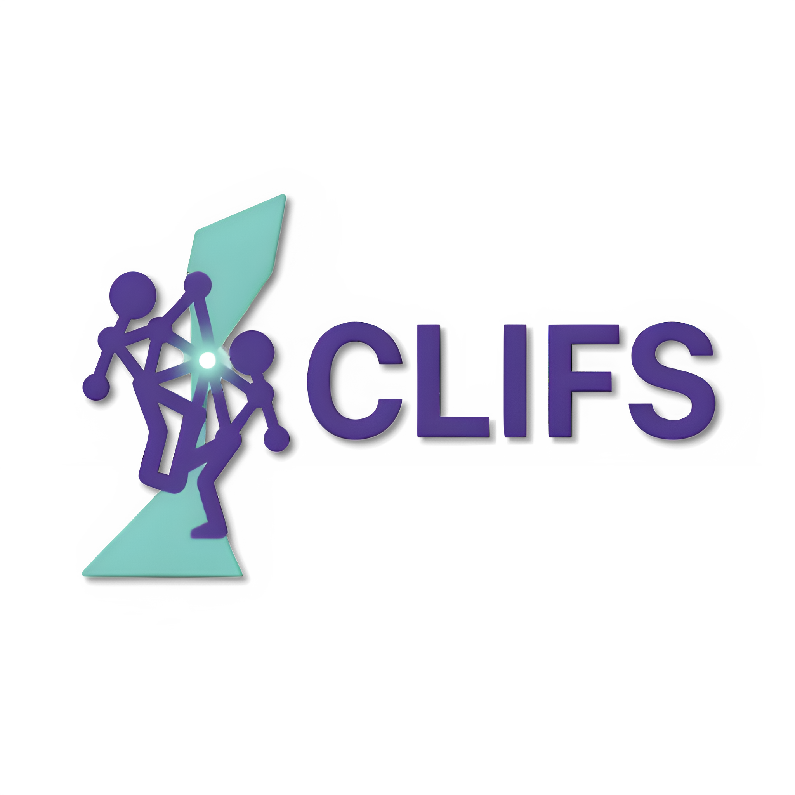
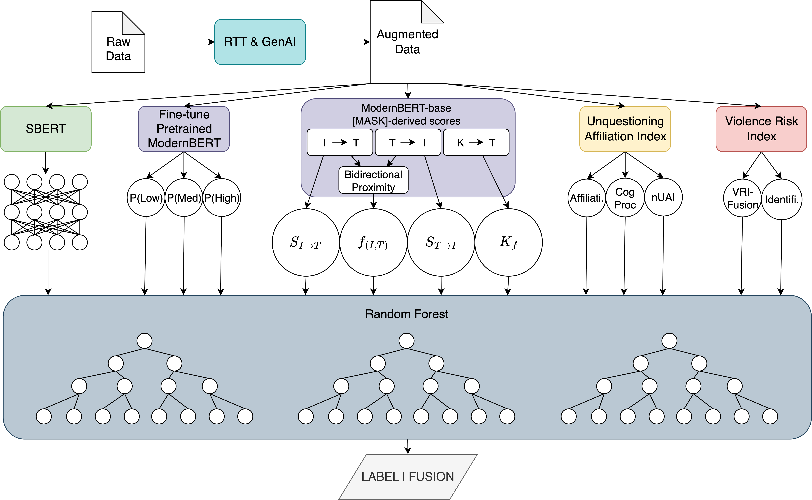
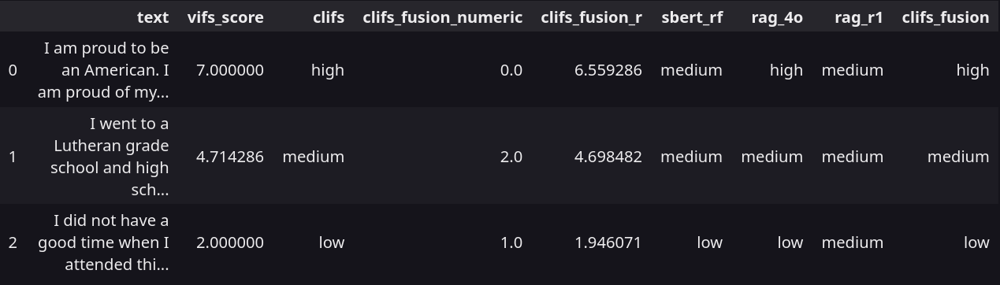

<p align="center">
  
</p>

# CLIFS: Cognitive Linguistic Identity Fusion Score

CLIFS (Cognitive Linguistic Identity Fusion Score) is the official implementation of the method introduced in our EMNLP 2025 paper. It is a cognition-informed Python framework for quantifying identity fusion from text, combining cognitive linguistics, implicit metaphor detection, and machine learning. Unlike prior self-report or dictionary-based methods, CLIFS directly predicts identity fusion from natural language, validated against the gold-standard Verbal Identity Fusion Scale (VIFS). This allows researchers and practitioners to efficiently assess identity fusion in large-scale text data, with applications in computational social science, social psychology, political science, security, and beyond.

## Performance Notes

CLIFS outperformed all prior methods and human annotation:

- **+6–154%** classification improvement vs. **baselines**
- **+128–2,914%** correlation gain for regression vs. **baselines**
- **+11–22%** improvement vs. **human** annotation (classification)
- **+10%** correlation gain vs. **human** annotation (regression)
- **-25%** error reduction vs. **human** annotation (regression)

Practical Downstream Impact:

- Violence Risk Prediction
    - Integrated CLIFS into violence risk prediction model
    - **+240%** classification improvement over existing fusion-based violence risk assessment
    - Demonstrates CLIFS's applied value in counter-radicalization and security

## Overview

Identity fusion is a psychological state where an individual's personal identity becomes deeply intertwined with a target (e.g., "a religious group, political party, ideology, value, brand, belief, etc."), creating porous boundaries between the self and that target. In our EMNLP 2025 work, we introduce a new NLP task: predicting identity fusion levels directly from text, as both regression (fine-grained) and classification (coarse-grained; low/medium/high).

CLIFS measures this phenomenon through multiple complementary approaches:

<!--  -->
<p align="center">
  
</p>

1. **Masked Language Model Identity Fusion (MLMIF)**: Uses transformer models to compute bidirectional (reciprocal) conceptual similarity scores between identity and target words [the scores; $f(I, T)$ (Fusion Proximity), $K_f$ (Fictive Kinship), $S_{I \to T}$, and $S_{T \to I}$ (the directional proximity scores), described fully in the EMNLP paper].
2. **naive Unquestioning Affiliation Index (nUAI)**: Measures affiliation and cognitive processing patterns in text. Based on Ashokkumar & Pennebaker (2022). The naive version is introduced in the Wright et al. (2025) paper. However, the full version can be found in libs/ directory for reference.
3. **Violence Risk Index Lite (VRI-lite)**: Tracks fusion-related (kinship) and identification vocabulary usage. Based on Ebner et al. (2023). The lite version here only includes the core markers relevant to fusion, omitting additional violence risk factors (and irrelevant narrative categories which include harmful content). The full version is used as comparison in the EMNLP 2025 paper, but is not included in the public repository to avoid ethical concerns. CLIFS itself only uses the lite version (Wright et al., 2025).
4. **ModernBERT Classification**: Fine-tuned transformer model for direct fusion classification and softmax probabilities.
5. **SBERT Embeddings**: Semantic embeddings to capture semantic patterns not yet explored in prior work ([all-mpnet-base-v2](https://huggingface.co/sentence-transformers/all-mpnet-base-v2)).
6. **RAG Fusion Classification**: Retrieval-augmented generation using OpenAI 4o and DeepSeek r1 models.
7. **CLIFS Random Forest**: A Random Forest model utilizing outputs from the above components as features and trained to predict identity fusion levels (both regression and classification).
8. **Ensemble Methods**: Combines multiple models for robust classification (only for classification).

## Installation

### Environment Setup

1. **Clone and navigate to the repository**:

```bash
git clone https://github.com/DevinW-sudo/CLIFS.git
cd CLIFS
```

2. **Download fine-tuned model and place in proper directory**:

```bash
DIR="models/best_mbert_model/best_mbert_model/modern_BERT_fusion_augmented_data_finegrain"
mkdir -p "$DIR"

curl -s https://api.github.com/repos/DevinW-sudo/CLIFS/releases/tags/v0.1.0 \
| jq -r '.assets[].browser_download_url' \
| while read -r url; do
    echo "Downloading $(basename "$url") ..."
    curl -L -o "$DIR/$(basename "$url")" "$url"
  done
echo "Download complete."
```

3. **Install Anaconda or Mamba if you don't have it already.**
   - [Anaconda Installation Instructions](https://docs.conda.io/projects/conda/en/latest/user-guide/install/index.html)
   - [Mamba Installation Instructions](https://github.com/conda-forge/miniforge) I always recommend Mamba 😉

4. **Create and activate conda environment**:

First, navigate to the project root directory. Then, for systems with GPU support (CUDA), run:

```bash
conda env create -f environment.yml
conda activate clifs
```
*For CPU-only (no GPU) systems:*

```bash
conda env create -f environment_cpu.yml
conda activate clifs_cpu
```

5. **Install additional dependencies**:

```bash
pip install git+https://github.com/huggingface/transformers.git@31ab7168ff7e07f61c90134e5238c4d97606aa70
```

6. **Install the CLIFS package**:

```bash
pip install -e libs/clifs --use-pep517
```

## Quick Start

```python
import pandas as pd
from clifs import clifs

# Load your data
df = pd.read_csv('your_data.csv')  # Must have 'text' column

# Define known groups for your analysis
# (targets you already know about in your data)
# NOTE: This parameter is optional; if not provided, CLIFS will use
# default generic group words. However, it is highly recommended to
# specify relevant groups for best performance. The list is expanded
# by the CLIFS system to include related terms.
KNOWN_GROUPS = ["your", "target", "groups"]
# e.g., KNOWN_GROUPS = {"religion", "religious", "church", "god", "college", "university", "school", "usa", "country", "america"}
```

#### CLIFS

```python
# CLIFS scoring
# By default, uses base CLIFS model (Random Forest on core features)
# Performs coarse-grained identity fusion classification (low/medium/high)
df_results = clifs.clifs(
    df=df, 
    known_groups=KNOWN_GROUPS,
    save_path='results.csv'
)

# CLIFS regression (continuous scores)
df_regression = clifs.clifs(
    df=df,
    known_groups=KNOWN_GROUPS,
    regression=True,
    save_path='regression_results.csv'
)
```

#### CLIFS Ensemble

```python
# CLIFS ensemble (multiple models; classification only)
# Models: CLIFS RF, SBERT RF, RAG GPT-4o, RAG DeepSeek R1
df_ensemble = clifs.clifs(
    df=df,
    known_groups=KNOWN_GROUPS,
    ensemble=True,
    save_path='ensemble_results.csv'
)

```

## Output Features

The system generates multiple prediction columns:


### Classification:

- **CLIFS:**

  * `clifs`: CLIFS Random Forest prediction
  * `clifs_fusion_numeric`: Numeric encoding of prediction

- **CLIFS Ensemble:**

  * `sbert_rf`: SBERT Random Forest prediction
  * `clifs`: CLIFS Random Forest prediction
  * `rag_4o`: RAG with GPT-4o prediction
  * `rag_r1`: RAG with DeepSeek R1 prediction
  * `clifs_fusion`: Hard voting ensemble result
  * `clifs_fusion_numeric`: Numeric encoding of ensemble

### Regression:
* `clifs_fusion_r`: Continuous fusion score

## Example Input/Output

### High Fusion Example

**VIFS Score: 7.0**

"I am proud to be an American. I am proud of my country's heritage. America has tried to be a good friend and neighbor to other nations. It is fought for other countries on their soil. It has been a world leader on most friends for many years. Many people take issue with America even people who live here. I say if you don't like it here move somewhere else. No one is making you stay. That's one of the great things about America if you don't like it you can leave. We owe allegiance to our country. People who badmouth our country don't earn my respect. People who burn the American flag don't earn my respect. America allows freedoms that many other countries don't tolerate. We must come together as a group and make America all that it can be. We the people are the ones who make it strong. No nation is perfect because no person is perfect but through our love for our nation we make America what it is. It is our responsibility to make it better. If America would fail it would be because we the people failed. When thinking about our past sure there is good and bad. But we have learned from the experiences and progressed to the nation we are today. Let's continue to make it even better."

* CLIFS Prediction: **High Fusion**
* CLIFS Ensemble Prediction: **High Fusion**
* CLIFS Regression Prediction: **6.559286**

### Medium Fusion Example

**VIFS Score: 4.714286**

"I went to a Lutheran grade school and high school so I took a lot of religion classes and was confirmed at my local church.  Both my parents are deeply religious and did their best to raise me in a committed Christian home.  This set a strong foundation for my faith that has lasted to this point in my life and I hope that it will see me through until my death.  I now live a moderate distance from my parents and the church that I was raised in and as such do not attend services with them anymore.  I tend to not go to church due to the misguided belief that I know everything that I need to know in order to get into heaven.  This does not mean that I have neglected my spiritual learning.  I read the Bible regularly and pray especially when I selfishly need something.  The biggest reason that I do not attend church services is because I have some social anxiety and it bothers me when people fixate on my presence.  They always want to get chummy and that isn't really for me.  Instead I sometimes watch sermons on YouTube as well as educational Christian documentaries.  I also enjoy the writings of Philip Yancey.  I like the way he explores the nature of God and I find his point of view to be very eye opening."

* CLIFS Prediction: **Medium Fusion**
* CLIFS Ensemble Prediction: **Medium Fusion**
* CLIFS Regression Prediction: **4.698482**

### Low Fusion Example

**VIFS Score: 2.0**

"I did not have a good time when I attended this university.  I thought the cost was excessively high and the administration was lousy.  I had several problems getting financial aid credited to my account and spent far more time that I should have trying to get financial things sorted out.  I also did not get full credit for a class which lowered my GPA.  This resulted in my not getting credit for an honors degree when I actually should have graduated cum laude.  Again  I had to argue and fight to try to get that credit so you can imagine that I don't have positive feelings about this school.  They have dogged me for years trying to get me to contribute to a scholarship fund and I just throw out their mailings every time they come through.  I don't know how they manage to find me every time I move...  Perhaps if they spent as much effort in ensuring students get full credit for classes and don't have to pay through the nose for an education as they do in trying to chase those students for scholarship money after they graduate  maybe they'd have more money in their scholarship funds...  All in all  I feel I could have gotten much more from a public college than I did from Hamline.  I still resent that I had to take a religious course as a requirement for graduation.  I'm not a religious person and found this annoying and not any help at all in my career.  Big waste of money in my opinion."

* CLIFS Prediction: **Low Fusion**
* CLIFS Ensemble Prediction: **Low Fusion**
* CLIFS Regression Prediction: **1.946071**

**Output From All Methods:**



**NOTE:** Examples comes from the test set of the Wright et al. (2025) paper, of which all data is repurposed from the publicly available [Ashokkumar & Pennebaker (2022) dataset](https://osf.io/dwkec/files/osfstorage). See the paper for full details.

## Model Files

Required model files (place in `models/` directory):

* `best_rf/best_model_rf_aug.joblib`: Main CLIFS Random Forest model
* `best_rf/sbert_classification_best_model_augmented.joblib`: SBERT classifier
* `best_rf/augmented_regression_best.joblib`: Regression model
* `best_mbert_model/`: Fine-tuned ModernBERT model

## API Requirements

For ensemble mode, you'll need API keys for:

* OpenAI (GPT-4o)
* DeepSeek (R1 Reasoner)

## Project Structure


```
clifs/              # Main source code and package
libs/               # Python package and setup files
models/             # Pre-trained and fine-tuned models
data/               # Augmented training/reference data (for RAG)
exec_dir/           # Execution outputs and logs
README.md           # Project documentation
environment.yml     # Conda environment (GPU)
environment_cpu.yml # Conda environment (CPU)
```

## Contributing

This research framework is developed by Devin R. Wright. For questions, issues, or contributions, please open an issue. You can find contact information at https://devwright.com or in the paper. Please feel free to contact me, especially if you are interested in collaborating!

## Ethical Use

CLIFS is a research tool intended to augment—not replace—human judgment, especially in sensitive domains such as violence risk assessment. While CLIFS achieves strong performance, it inherits limitations from its training data (English-language, U.S.-based essays and synthetic AI-generated data) and should not be assumed to generalize universally across cultures or contexts. This will be addressed in future work. Scores should always be interpreted alongside other sources of information and not as standalone determinants.

## Citation

This framework is the reference codebase for the following publication:

* **Wright, Devin R., An, Jisun, & Ahn, Yong-Yeol. (2025). Cognitive Linguistic Identity Fusion Score (CLIFS): A Scalable Cognition-Informed Approach to Quantifying Identity Fusion from Text. *Proceedings of EMNLP 2025*.** To appear.

If you use CLIFS in your research, please cite the EMNLP 2025 paper introducing the method:

```bibtex
@inproceedings{wright2025clifs,
  title={Cognitive Linguistic Identity Fusion Score (CLIFS): A Scalable Cognition-Informed Approach to Quantifying Identity Fusion from Text},
  author={Wright, Devin R. and An, Jisun and Ahn, Yong-Yeol},
  booktitle={Proceedings of the 2025 Conference on Empirical Methods in Natural Language Processing (EMNLP)},
  year={2025}
}
```

---
